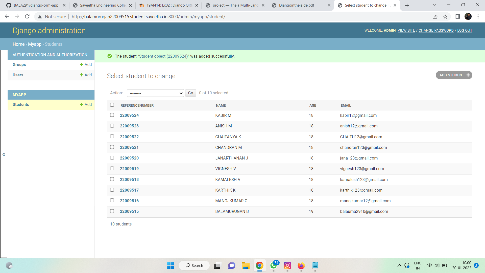

# Django ORM Web Application

## AIM
To develop a Django application to store and retrieve data from a database using Object Relational Mapping(ORM).

## Entity Relationship Diagram

Include your ER diagram here

## DESIGN STEPS

### STEP 1:

Git clone django-orm-project

### STEP 2:

Start myapp and create models and admin

### STEP 3:

Create superuser as admin

### STEP 4:

Migration of myapp to the server

### STEP 5:

Testing the admin page

## PROGRAM


MODEL EMPLOYEE PROGRAM:
```
from django.db import models
from django.contrib import admin

#create your models here.
class Student (models.Model):
    referencenumber=models.CharField(primary_key=True, max_length=20,help_text="reference number")
    name=models.CharField(max_length=100)
    age=models.IntegerField()
    email=models.EmailField()

class StudentAdmin(admin.ModelAdmin):
    list_display=('referencenumber','name','age','email')
```

ADMIN SITE PROGRAM:
```
from django.contrib import admin

from .models import Student,StudentAdmin

# Register your models here.
admin.site.register(Student,StudentAdmin)
```
Include your code here

## OUTPUT




## RESULT
A Django application to store and retrieve data from a database using object relational mapping (ORM) is developed.